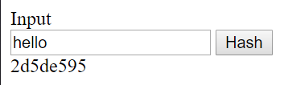

### Homework 3
#### Team Barracuda
##### Darrin Landroche, Michael Einreinhof, Caleb Maughan


Pseudocode: 
```
function(string)
    // This number could be changed to 
    // result in a different output
   hash = 237845927; 
   i = 0;

    for each character (i) in string
        if(i < string.length - 2)
            value = string[i].toAscii + string[i+1].toAscii;
        else
            value = string[i].toAscii + hash;

        hash ^= ((hash << 5) + value + (hash >> 2));
        hash = hash.reverse()

   return hash.to_hexadecimal
```

How our algorithm satisfies the requirements: 
1) Computationally Efficient

This algorithm runs in $O(n)$ time with $n$ being the length of the input string. This is because we loop over each of the characters one time and do constant operations on each.

2) Deterministic

There are no randomized pieces, so output is based completely on input data. For a given input, the output will always be the same.

3) Pre-Image Resistant

We added a hash reverse each iteration of the loop, so that the hash appears "scrambled," but remains deterministic. For example, with the given inputs "hello" and "helol", the outputs were:

 
 

These outputs only have one character in common (the first instance 2).

4) Collision Resistant

Based on the use of each character, never recycling values, and calculating the value using two characters at a time, our algorithm is collision resistant.

Implementation code (JavaScript): 

```
function hashFunction(str)
{
    str = str.toString();
    let hash = 237845927;
    let i = 0;

    for (i = 0; i < str.length; i++)
    {
        let value;
        if(i < str.length - 2) {
            value = str[i].charCodeAt() + str[i+1].charCodeAt();
        } else {
            value = str[i].charCodeAt() + hash;
        }

        hash ^= ((hash << 5) + value + (hash >> 2));
        hash = parseInt(hash.toString().split("").reverse().join(""));
    }

    return hash.toString(16);
}
```